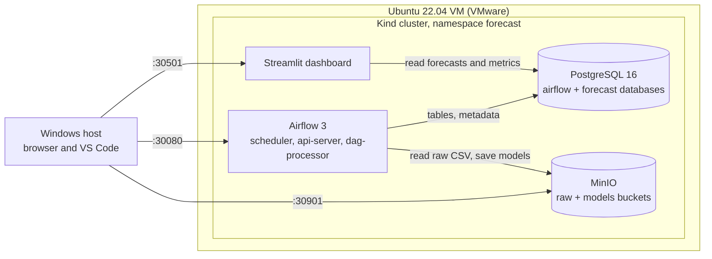

# End-to-End Forecasting Platform on Kubernetes

An automated data engineering and MLOps platform that ingests daily store sales, trains and tunes forecasting models, validates them, versions the best one in a model registry, generates forecasts up to 12 months ahead, and publishes them to a business dashboard. Every component is containerized and runs on a local Kubernetes cluster, orchestrated by Apache Airflow on a weekly schedule.

## Objective

Simulate a production forecasting system in which models are retrained periodically without manual intervention, with full traceability from raw data to published forecast. The use case is daily sales forecasting for 10 retail stores and 50 products (Kaggle "Store Item Demand Forecasting Challenge", 913,000 rows, 2013–2017).

## Architecture



Airflow is the only component that writes data. The dashboard only reads. MinIO stores files (raw data, model artifacts) and PostgreSQL stores tables (clean data, features, metrics, registry, forecasts).

## Technology stack

| Layer | Technology |
|---|---|
| Infrastructure | Docker, Kubernetes 1.34 via Kind (single node), Helm |
| Orchestration | Apache Airflow 3 (official Helm chart, LocalExecutor) |
| Storage | PostgreSQL 16, MinIO (S3-compatible object storage) |
| Data processing | Python, pandas, NumPy, SQLAlchemy |
| Machine learning | LightGBM, Prophet, Optuna (Bayesian optimization, TPE sampler) |
| Visualization | Streamlit, Plotly |
| Version control | Git, GitHub |

## Pipeline

The `forecasting_pipeline` DAG runs every Monday at 02:00 and can also be triggered on demand.


| Stage | Module | What it does | Output |
|---|---|---|---|
| 1. Ingestion | `src/ingest.py` | Reads the CSV from MinIO, runs 5 data quality checks | `raw_sales`, `data_quality_log` |
| 2. Cleaning | `src/clean.py` | Deduplication, timestamp normalization, gap filling, outlier capping (rolling median + IQR), store-level aggregation | `clean_sales`, `sales_daily_store` |
| 3. Features | `src/features.py` | 30 leak-free features: calendar, holidays, peak season, Fourier terms, lags (1, 7, 28), rolling mean/median/std (7, 28) | `features_store` |
| 4. Tuning | `src/tune.py` | Optuna, 20 trials per model, 2 expanding-window folds, SMAPE objective | `hyperparameter_runs` |
| 5. Training | `src/train.py` | Fits 10 Prophet models and 1 global LightGBM on data before the test period | MinIO `candidates/<run_id>/`, `training_runs` |
| 6. Cross-validation | `src/cross_validate.py` | 4 rolling folds of 90 days covering a full year, 5 metrics, error by horizon | `cv_fold_metrics`, `cv_predictions` |
| 7. Evaluation | `src/evaluate.py` | Final test on the untouched last 90 days, residual analysis, 80% interval coverage, winner selection | `evaluation_results`, `test_predictions` |
| 8. Registry | `src/register.py` | Quality gate (SMAPE < 10%), refit on all data, versioning, dataset fingerprint, archiving of the previous model | MinIO `registry/store-sales/v<N>/`, `model_registry` |
| 9. Forecasting | `src/forecast.py` | 365-day forecast from the production model, intervals, trend and seasonality, top-down product forecasts | `forecasts`, `forecasts_item` |
| 10. Publishing | `src/publish.py` | Refreshes dashboard views and KPIs | `latest_forecast`, `production_model`, `dashboard_kpis` |

Shared code lives in `src/models.py` (splits, fitting, recursive forecasting, intervals), `src/metrics.py`, `src/features.py` (`make_features()` is reused for training and forecasting to avoid training/serving skew), `src/storage.py` and `src/db.py`.

## Results

Test period: October 3 to December 31, 2017 (90 days, including the holiday peak), never seen during tuning or training.

| Metric | LightGBM (selected) | Prophet |
|---|---|---|
| SMAPE | **2.58%** | 4.51% |
| RMSE | **91.5** | 162.3 |
| MAE | **68.6** | 115.8 |
| Bias | **−0.28%** | +0.99% |
| Residual autocorrelation (lag 1) | **0.20** | 0.54 |
| 80% interval coverage | **84.6%** | 74.6% |
| CV SMAPE (4 folds, mean ± std) | **2.87% ± 0.47** | 4.05% ± 1.39 |

Key findings:

- LightGBM wins on every metric and in all 10 stores. Cross-validation predicted the test ranking and error level correctly.
- Tuning alone (3 stores, spring–summer folds) favoured Prophet. Cross-validation over a full year revealed Prophet's parameters were overfitted to the tuning period, which justifies a separate CV stage.
- Two independent pipeline runs produced identical dataset fingerprints and identical scores: the pipeline is reproducible (fixed seeds for Optuna and LightGBM).
- The 2018 forecast predicts +3.8% growth, consistent with 2017's +3.6%.

## Project structure

```
forecast-platform/
├── dags/                 Airflow DAGs (forecasting_pipeline, hello_forecast connectivity test)
├── src/                  Pipeline logic, one module per stage + shared helpers
├── dashboard/app.py      Streamlit dashboard
├── docker/               Dockerfiles and requirements for Airflow and the dashboard
├── k8s/                  Kind config, PostgreSQL, MinIO, Airflow NodePort, dashboard manifests
├── helm/                 Airflow Helm values
├── scripts/              Build-and-deploy scripts
├── docs/RUNBOOK.md       Daily operations and troubleshooting
└── data/raw/             Local dataset copy (not versioned)
```

## Getting started

Prerequisites: Docker, Kind, kubectl matching the cluster version (1.34), Helm, Python 3.10+, and about 10 GB of RAM available for the VM.

```bash
# 1. Cluster and storage
kind create cluster --config k8s/kind-config.yaml
kubectl create namespace forecast
kubectl apply -f k8s/postgres.yaml -f k8s/minio.yaml
kubectl get pods -n forecast -w        # wait for 1/1 Running

# 2. Airflow metadata database
kubectl exec -it -n forecast deploy/postgres -- psql -U forecast -d forecast -c "CREATE DATABASE airflow;"

# 3. Buckets and dataset (train.csv from Kaggle placed in data/raw/)
python3 -m venv .venv && source .venv/bin/activate
pip install pandas sqlalchemy psycopg2-binary boto3
python -c "from src.config import get_s3_client; s3 = get_s3_client(); [s3.create_bucket(Bucket=b) for b in ('raw', 'models')]; s3.upload_file('data/raw/train.csv', 'raw', 'train.csv')"

# 4. Airflow (set AIRFLOW_BASE in docker/airflow.Dockerfile to the chart's airflowVersion first)
helm repo add apache-airflow https://airflow.apache.org && helm repo update
./scripts/deploy_airflow.sh
kubectl apply -f k8s/airflow-nodeport.yaml

# 5. Run the pipeline once from the Airflow UI, then deploy the dashboard
./scripts/deploy_dashboard.sh
```

## Accessing the services

| Service | URL | Credentials (local development only) |
|---|---|---|
| Airflow | `http://<VM_IP>:30080` | admin / admin |
| Dashboard | `http://<VM_IP>:30501` | none |
| MinIO console | `http://<VM_IP>:30901` | minioadmin / minioadmin123 |
| PostgreSQL | `<VM_IP>:30432` | forecast / forecast123 |

Pods communicate internally through service names (`postgres.forecast.svc.cluster.local:5432`, `minio.forecast.svc.cluster.local:9000`). `src/config.py` reads connection settings from environment variables, with defaults pointing to the NodePorts, so the same code runs locally and inside the cluster.

See [docs/RUNBOOK.md](docs/RUNBOOK.md) for starting, stopping, deploying changes and troubleshooting.

## Design decisions

- **Test set locked from day one**: the last 90 days are excluded from tuning and training, giving an honest performance estimate.
- **Recursive forecasting for LightGBM**: each predicted day is fed back as a lag for the next, using the same `make_features()` as training.
- **Empirical prediction intervals for LightGBM**: built from cross-validation errors per horizon, validated by test coverage (84.6% for a nominal 80%).
- **Candidates vs registry**: trained models are candidates until the evaluation stage selects one; only the winner is refitted on all data and registered.
- **Atomic registry update**: archiving the old production model and registering the new one happen in a single database transaction.
- **Lean resources**: LocalExecutor, shared PostgreSQL, no Redis or Celery workers, so the full platform fits in a 10 GB VM.

## Limitations and future work

- **Long-horizon extrapolation**: tree models cannot predict above the highest values seen in training, so 12-month growth is weakest at the summer peak (+1.7% in July vs +5.9% in February). A hybrid approach (LightGBM for short horizons, a trend model for long horizons) would address this.
- **Intervals beyond 90 days** reuse the 31–90 day error profile and were not validated on longer horizons.
- **Tuning folds** cover April–October only. Full-year tuning folds would likely give Prophet fairer parameters.
- **Static dataset**: weekly runs reproduce the same results. In production, new data would land in the `raw` bucket each week.
- **Secrets**: development passwords are stored in plain text in Kubernetes manifests and Helm values. Production would use a secret manager (Sealed Secrets, External Secrets, Vault).
- **No CI/CD**: builds and deployments are run manually through scripts. A GitHub Actions workflow could lint, test and build images on every push.
- **Single-node cluster**: no high availability. A real deployment would use a managed multi-node cluster and a container registry instead of `kind load`.
- **Product forecasts** use a top-down split by recent share, which assumes stable product mix.

## Author

Amine, internship project, july 2026.

